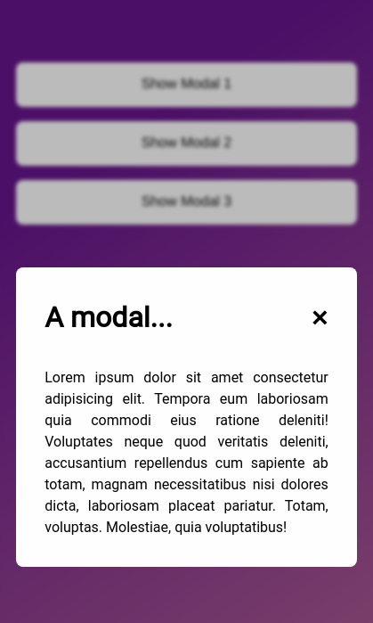
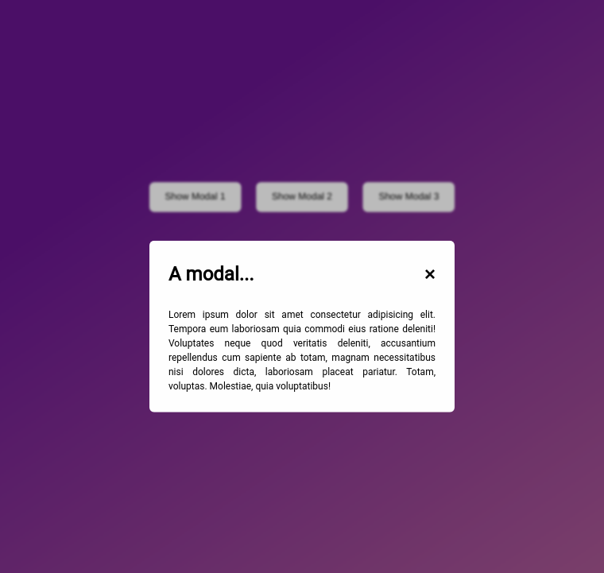

# Modal

This project is about DOM manipulation in Javascript and based on Jonas Schmedtmann's "The completed Javascript Course 2021" and done independently to consolidate knowledge.
The main goal consist of accessing elements and attach to them an event listener method.
When an event occurs, a handler which is a related function with specfic instructions are being executed as showing or hidding elements.

## How to use it ?

To use the app, the user have to click on one of the 3 buttons to show the modal.
Once opened, the modal can be closed either by clicking the cross button or by pressing the escape key.

## Stack

- HTML
- CSS
- Javascript

## Screenshots

Mobile :

 

Desktop :
 

